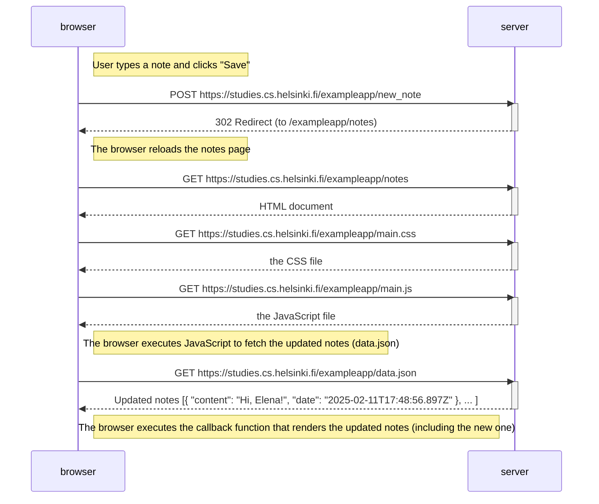

```mermaid
sequenceDiagram
    participant browser
    participant server

    Note right of browser: User types a note and clicks "Save"

    browser->>server: POST https://studies.cs.helsinki.fi/exampleapp/new_note
    activate server
    server-->>browser: 302 Redirect (to /exampleapp/notes)
    deactivate server

    Note right of browser: The browser reloads the notes page

    browser->>server: GET https://studies.cs.helsinki.fi/exampleapp/notes
    activate server
    server-->>browser: HTML document
    deactivate server

    browser->>server: GET https://studies.cs.helsinki.fi/exampleapp/main.css
    activate server
    server-->>browser: the CSS file
    deactivate server

    browser->>server: GET https://studies.cs.helsinki.fi/exampleapp/main.js
    activate server
    server-->>browser: the JavaScript file
    deactivate server

    Note right of browser: The browser executes JavaScript to fetch the updated notes (data.json)

    browser->>server: GET https://studies.cs.helsinki.fi/exampleapp/data.json
    activate server
    server-->>browser: Updated notes [{ "content": "Hi, Elena!", "date": "2025-02-11T17:48:56.897Z" }, ... ]
    deactivate server

    Note right of browser: The browser executes the callback function that renders the updated notes (including the new one)
```