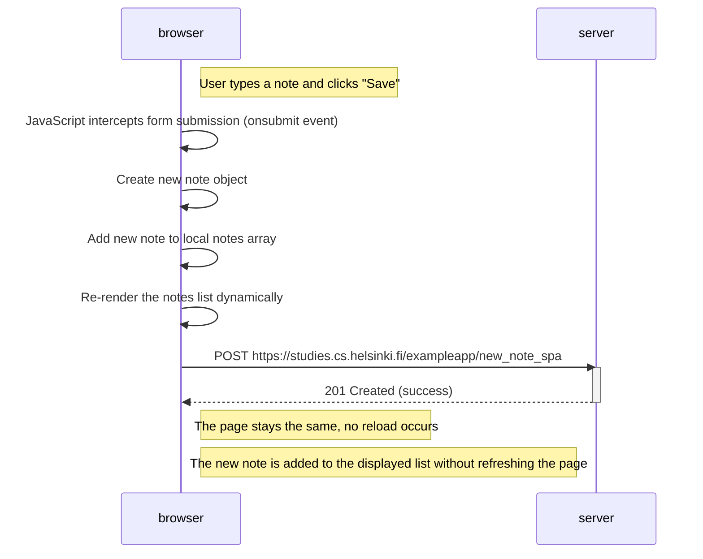

```mermaid
sequenceDiagram
    participant browser
    participant server

    Note right of browser: User types a note and clicks "Save"

    browser->>browser: JavaScript intercepts form submission (onsubmit event)
    browser->>browser: Create new note object
    browser->>browser: Add new note to local notes array
    browser->>browser: Re-render the notes list dynamically

    browser->>server: POST https://studies.cs.helsinki.fi/exampleapp/new_note_spa
    activate server
    server-->>browser: 201 Created (success)
    deactivate server

    Note right of browser: The page stays the same, no reload occurs
    Note right of browser: The new note is added to the displayed list without refreshing the page


```